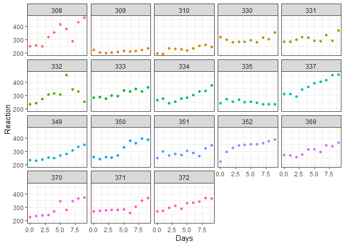
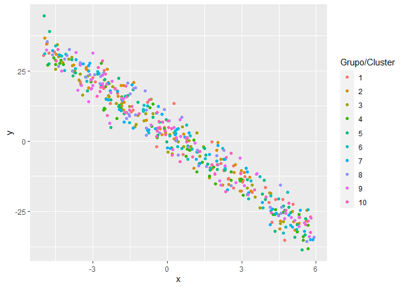
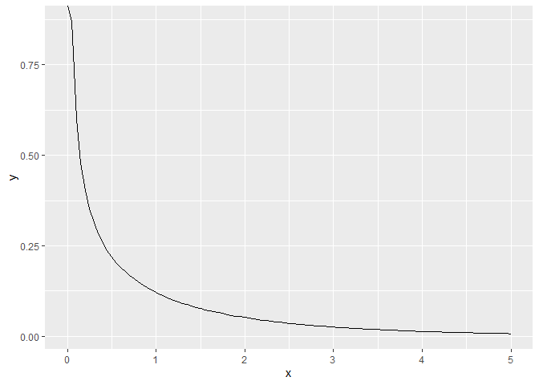
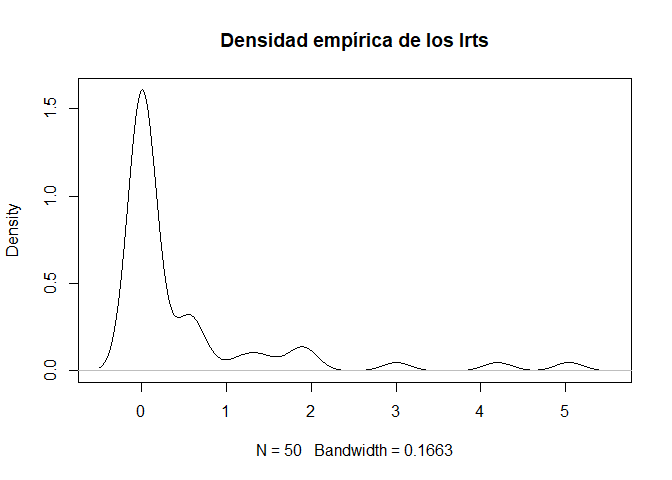

readme
================
Santiago Franco Valencia
14/9/2022

``` r
library(lme4)
```

    ## Loading required package: Matrix

``` r
library(stargazer)
```

    ## Warning: package 'stargazer' was built under R version 4.1.2

    ## 
    ## Please cite as:

    ##  Hlavac, Marek (2022). stargazer: Well-Formatted Regression and Summary Statistics Tables.

    ##  R package version 5.2.3. https://CRAN.R-project.org/package=stargazer

``` r
library(merTools)
```

    ## Warning: package 'merTools' was built under R version 4.1.3

    ## Loading required package: arm

    ## Warning: package 'arm' was built under R version 4.1.3

    ## Loading required package: MASS

    ## 
    ## arm (Version 1.13-1, built: 2022-8-25)

    ## Working directory is C:/Users/SantiagoFranco/OneDrive - DATAKNOW S.A.S/Documentos/hierarchical-models-in-R

``` r
library(nlme)
```

    ## 
    ## Attaching package: 'nlme'

    ## The following object is masked from 'package:lme4':
    ## 
    ##     lmList

``` r
library(RLRsim)
```

    ## Warning: package 'RLRsim' was built under R version 4.1.3

``` r
library(emdbook) # Para usar la función dchibarsq
```

    ## Warning: package 'emdbook' was built under R version 4.1.3

``` r
library(ggplot2)
```

# Summary of GLM and LM

Se resumen las funciones utilizadas en los capítulos 3, 4, 5 y 6 del
texto guía de modelos jerarquícos:

## Linear regression


``` r
data(cars)
cars.lm <- lm(dist ~ speed, data = cars)
summary(cars.lm)
```

    ## 
    ## Call:
    ## lm(formula = dist ~ speed, data = cars)
    ## 
    ## Residuals:
    ##     Min      1Q  Median      3Q     Max 
    ## -29.069  -9.525  -2.272   9.215  43.201 
    ## 
    ## Coefficients:
    ##             Estimate Std. Error t value Pr(>|t|)    
    ## (Intercept) -17.5791     6.7584  -2.601   0.0123 *  
    ## speed         3.9324     0.4155   9.464 1.49e-12 ***
    ## ---
    ## Signif. codes:  0 '***' 0.001 '**' 0.01 '*' 0.05 '.' 0.1 ' ' 1
    ## 
    ## Residual standard error: 15.38 on 48 degrees of freedom
    ## Multiple R-squared:  0.6511, Adjusted R-squared:  0.6438 
    ## F-statistic: 89.57 on 1 and 48 DF,  p-value: 1.49e-12

``` r
new.dat <- data.frame(speed=30)
#Confidence intervals and predictions
predict(cars.lm, newdata = new.dat, interval = 'confidence', level = 0.95)
```

    ##        fit      lwr      upr
    ## 1 100.3932 87.43543 113.3509

``` r
##See predict.lm() for more documentation
```

## Logistic regression


### functions

``` r
logit <- function(x){
  return(log((x)/(1-x)))
}
inverse_logit <- function(x){
  return(exp(x)/(1+exp(x)))
}
```

### Fitting logistic regression models:

``` r
formula = ""
#logit_model <- glm(formula = formula, family=binomial(link='logit'))
```

### Interpretation of logistic regression coeficients:

-   Constant term can be interpreted as the estimated probability when
    other variables has the value of 0. (The “Weight” of the constant
    term).

-   The pendient terms can be interpreted as the estimated probability
    per unit by deriving the predictor inside the linf formula.

### Graphic logistic regretion:

``` r
#Graph logit func:
## Plot x and y values
#plot(x,y)
## Plot curve of the model using the formula
#curve()
```

## Generalized linear models

Allos the answer Y to be normal, binomial, poisson, negative-binomial,
gamma, and inverse gaussian.

The variable Y is not modeled insted the mu parameter of the variable Y
is modeled.

``` r
#Adjust model
#glm(formula, data=data, family=linkfunction())
#Predict
#link = predict(nb1, type = "link"),
#fit = predict(nb1, type = "response"),
```

The link function allows to map the predictor variable values inside the
correct parameter of the distribution assumed for Y.

It is important to know that te parameter *family* of the glm package
allows to assume certain distribution for the Y variable.

## Notes about mixed models

### Tipos de variables en modelos mixtos

Respuesta Y

Convariables x1,…, xk: Cuantitativas o cualitativas

De agrupación g1,…,g2: Sólo cualitativas y cada gj debe ser una m.a de
los niveles existentes. Ejemplo: Persona, barrio, ciudad departamento

### no pooling

### Complete pooling

### Multilevel modeling

## Notación para efectos aleatorios:

*b*<sub>0</sub>, *b*<sub>1</sub>, ...
*α*<sub>0</sub>, *α*<sub>1</sub>...
*U*<sub>0</sub>, *U*<sub>1</sub>, ...
*b*<sub>0*i*</sub> : Intercepto aleatorio para grupo i
$\\hat{b\_{0i}}: \\text{Intercepto aleatorio PREDICHO para grupo i}$

## ¿Cómo se reporta un modelo ajustado en un artículo científico?

### Modelo ajustado:

General:

$Y\_{ij}\\text{\~}N(\\hat{\\mu\_{ij}}, \\hat{\\sigma\_{y}})$
$\\hat{\\mu\_{ij}} = 2.2378 - 6.0264x\_{ij} + \\hat{b\_{0i}}$
$\\hat{\\sigma\_y} = 3.9352$ *b*<sub>0</sub> *N*(0, 25.3690)

Por grupo

Grupo 3:

$Y\_{3j}\\text{\~}N(\\hat{\\mu\_{3j}}, \\hat{\\sigma\_{y}})$ $ = 2.2378
+ 19.88 - 6.0264x\_{ij} $ $\\hat{\\sigma\_y} = 3.9352$
*b*<sub>0</sub> *N*(0, 25.3690)

¿Cuál es el valor esperado de Y cuando x=4? $E(Y\|x=4)\\hat{=}-2$

## Paquete lme4

### Función lmer

La función lmer es la principal función del paquete lme4. Esta función
sirve para ajustar un modelo mixto y su estructura es la siguiente:

``` r
lmer(formula, data = NULL, REML = TRUE, control = lmerControl(),
     start = NULL, verbose = 0L, subset, weights, na.action,
     offset, contrasts = NULL, devFunOnly = FALSE, ...)
```

Datos incluído en el paquete lmer:

``` r
head(sleepstudy)
```

    ##   Reaction Days Subject
    ## 1 249.5600    0     308
    ## 2 258.7047    1     308
    ## 3 250.8006    2     308
    ## 4 321.4398    3     308
    ## 5 356.8519    4     308
    ## 6 414.6901    5     308

``` r
ggplot(data = sleepstudy, aes(x = Days, y = Reaction, color = Subject)) +
  geom_point() +
  theme_bw() +
  facet_wrap(~ Subject) + 
  theme(legend.position = "none")
```

<!-- -->

### Planteamiento de modelos con lmer

``` r
fit <- lmer(Reaction ~ Days + (Days | Subject), REML = TRUE, data = sleepstudy)
```

``` r
summary(fit)
```

    ## Linear mixed model fit by REML ['lmerMod']
    ## Formula: Reaction ~ Days + (Days | Subject)
    ##    Data: sleepstudy
    ## 
    ## REML criterion at convergence: 1743.6
    ## 
    ## Scaled residuals: 
    ##     Min      1Q  Median      3Q     Max 
    ## -3.9536 -0.4634  0.0231  0.4634  5.1793 
    ## 
    ## Random effects:
    ##  Groups   Name        Variance Std.Dev. Corr
    ##  Subject  (Intercept) 612.10   24.741       
    ##           Days         35.07    5.922   0.07
    ##  Residual             654.94   25.592       
    ## Number of obs: 180, groups:  Subject, 18
    ## 
    ## Fixed effects:
    ##             Estimate Std. Error t value
    ## (Intercept)  251.405      6.825  36.838
    ## Days          10.467      1.546   6.771
    ## 
    ## Correlation of Fixed Effects:
    ##      (Intr)
    ## Days -0.138

### Efectos fijos y aleatorios:

Efectos fijos:

Efectos aleatorios

## Paquete nlme

### Ajuste con nlme

``` r
fit_lme <- lme(fixed = Reaction ~ Days, random = ~ 1+ Days | Subject,  data = sleepstudy, method = "REML")
```

``` r
summary(fit_lme)
```

    ## Linear mixed-effects model fit by REML
    ##   Data: sleepstudy 
    ##        AIC      BIC    logLik
    ##   1755.628 1774.719 -871.8141
    ## 
    ## Random effects:
    ##  Formula: ~1 + Days | Subject
    ##  Structure: General positive-definite, Log-Cholesky parametrization
    ##             StdDev    Corr  
    ## (Intercept) 24.740241 (Intr)
    ## Days         5.922103 0.066 
    ## Residual    25.591843       
    ## 
    ## Fixed effects:  Reaction ~ Days 
    ##                 Value Std.Error  DF  t-value p-value
    ## (Intercept) 251.40510  6.824516 161 36.83853       0
    ## Days         10.46729  1.545783 161  6.77151       0
    ##  Correlation: 
    ##      (Intr)
    ## Days -0.138
    ## 
    ## Standardized Within-Group Residuals:
    ##         Min          Q1         Med          Q3         Max 
    ## -3.95355735 -0.46339976  0.02311783  0.46339621  5.17925089 
    ## 
    ## Number of Observations: 180
    ## Number of Groups: 18

``` r
stargazer(fit_lme, type = 'latex')
```

% Table created by stargazer v.5.2.3 by Marek Hlavac, Social Policy
Institute. E-mail: marek.hlavac at gmail.com % Date and time: mar., oct.
25, 2022 - 10:21:49 p. m.
## Actividad en clase

``` r
ni <- 50
G <- &&&
nobs <- ni * &&&                      # Numero total de observaciones
grupo <- factor(rep(x=1:G, each=&&&)) # Para crear la variable grupal
obs <- rep(x=1:ni, times=G)           # Para identificar las obs por grupo
x <- runif(n=nobs, min=&&&, max=&&&)  # La covariable
b0 <- rnorm(n=G, mean=&&&, sd=&&&)    # El Intercepto aleatorio
b0 <- rep(x=b0, each=ni)              # El intercepto aleatorio pero repetido
media <- &&& - 6 * x + &&&            # La media
&&& <- rnorm(n=nobs, mean=media, sd=&&&) # La variable respuesta
datos <- data.frame(grupo, obs, b0, x, &&&) # Organizando el dataframe
```

``` r
ni <- 50
G <- 10
nobs <- ni * G                      # Numero total de observaciones
grupo <- factor(rep(x=1:G, each=ni)) # Para crear la variable grupal
obs <- rep(x=1:ni, times=G)           # Para identificar las obs por grupo
x <- runif(n=nobs, min=-5, max=6)  # La covariable
b0 <- rnorm(n=G, mean=0, sd=1)    # El Intercepto aleatorio
b0 <- rep(x=b0, each=ni)              # El intercepto aleatorio pero repetido
media <- 4 - 6 * x + b0            # La media
y <- rnorm(n=nobs, mean=media, sd=4) # La variable respuesta
datos <- data.frame(grupo, obs, b0, x, y) # Organizando el dataframe
```

``` r
ggplot(datos, aes(x, y, color=grupo) ) + 
  geom_point() + 
  labs(colour="Grupo/Cluster")
```

<!-- -->

## Cómo distinguir las componentes aleatorias de un modelo desde su fórmula?

### Pendiente aleatoria

``` r
```

### Intercepto aleatorio

``` r
model1 <- lmer(mathach ~ 1 + (1|schid), REML=FALSE, data=hsb)
summary(model1)
```

    ## Linear mixed model fit by maximum likelihood  ['lmerMod']
    ## Formula: mathach ~ 1 + (1 | schid)
    ##    Data: hsb
    ## 
    ##      AIC      BIC   logLik deviance df.resid 
    ##  47121.8  47142.4 -23557.9  47115.8     7182 
    ## 
    ## Scaled residuals: 
    ##      Min       1Q   Median       3Q      Max 
    ## -3.06262 -0.75365  0.02676  0.76070  2.74184 
    ## 
    ## Random effects:
    ##  Groups   Name        Variance Std.Dev.
    ##  schid    (Intercept)  8.553   2.925   
    ##  Residual             39.148   6.257   
    ## Number of obs: 7185, groups:  schid, 160
    ## 
    ## Fixed effects:
    ##             Estimate Std. Error t value
    ## (Intercept)  12.6371     0.2436   51.87

Según este resumen se tiene que:

-   $\\hat{\\sigma\_y}^2 = 39.148$
-   $\\hat{\\sigma\_{b\_0}}^2 = 8.553$

Para seleccionar este valor se tiene en cuenta que las estimaciones de
las varianzas siempre tienen que ver con los efectos aleatorios, ya que
la estructura del vector de parámetros es:

*θ* = (*β*<sub>0</sub>, *β*<sub>1</sub>, *σ*<sub>*y*</sub><sup>2</sup>, *σ*<sub>*b*<sub>1</sub></sub><sup>2</sup>, *σ*<sub>*b*<sub>0</sub>*b*<sub>1</sub></sub>

-   Los errores estándar no entran al vector de parámetros *θ*.

-   Cuando la varianza de un efecto es “grande” respecto a la varianza
    asociada a la variable respuesta se tienen indicios de que la
    variable asociada al efecto tiene un peso considerable sobre la
    variable respuesta.

**Intervalo de confianza**

``` r
confint(model1)
```

    ## Computing profile confidence intervals ...

    ##                 2.5 %    97.5 %
    ## .sig01       2.594729  3.315880
    ## .sigma       6.154803  6.361786
    ## (Intercept) 12.156289 13.117121

``` r
model2 <- lmer(mathach ~ 1 + female + ses + (1|schid), REML=FALSE, data=hsb)
summary(model2)
```

    ## Linear mixed model fit by maximum likelihood  ['lmerMod']
    ## Formula: mathach ~ 1 + female + ses + (1 | schid)
    ##    Data: hsb
    ## 
    ##      AIC      BIC   logLik deviance df.resid 
    ##  46599.7  46634.1 -23294.9  46589.7     7180 
    ## 
    ## Scaled residuals: 
    ##     Min      1Q  Median      3Q     Max 
    ## -3.1772 -0.7376  0.0344  0.7661  2.8044 
    ## 
    ## Random effects:
    ##  Groups   Name        Variance Std.Dev.
    ##  schid    (Intercept)  4.452   2.110   
    ##  Residual             36.804   6.067   
    ## Number of obs: 7185, groups:  schid, 160
    ## 
    ## Fixed effects:
    ##             Estimate Std. Error t value
    ## (Intercept)  13.2774     0.2019  65.778
    ## female       -1.1879     0.1654  -7.183
    ## ses           2.3577     0.1054  22.369
    ## 
    ## Correlation of Fixed Effects:
    ##        (Intr) female
    ## female -0.427       
    ## ses    -0.021  0.056

### Pendiente + intercepto aleatorio

## Comparación de modelos mediante anova

***IMPORTANTE***: La prueba que se realiza es una razón de
verosimilitud.

``` r
anova(model1, model2)
```

    ## Data: hsb
    ## Models:
    ## model1: mathach ~ 1 + (1 | schid)
    ## model2: mathach ~ 1 + female + ses + (1 | schid)
    ##        npar   AIC   BIC logLik deviance  Chisq Df Pr(>Chisq)    
    ## model1    3 47122 47142 -23558    47116                         
    ## model2    5 46600 46634 -23295    46590 526.07  2  < 2.2e-16 ***
    ## ---
    ## Signif. codes:  0 '***' 0.001 '**' 0.01 '*' 0.05 '.' 0.1 ' ' 1

*H*<sub>0</sub>: El modelo 2 no representa una mejora en el ajuste
respecto al modelo 1. *H*<sub>1</sub>: El modelo 2 representa una mejora
en el ajuste respecto al modelo 2.

En otras palabras:

*H*<sub>0</sub>:
(*β*<sub>*s**e**s*</sub> *β*<sub>*f**e**m**a**l**e*</sub>) = (0, 0)
*H*<sub>0</sub>:
(*β*<sub>*s**e**s*</sub> *β*<sub>*f**e**m**a**l**e*</sub>) ≠ (0, 0)

Términos más sencillos:

*H*<sub>0</sub>: El SES y el sexo NO ayudan a explicar el puntaje en
matemáticas de los estudiantes. *H*<sub>0</sub>: El puntaje SES o el
sexo ayudan a explicar el puntaje en matemáticas de los estudiantes.

``` r
sigma2b0 = 8.553
sigma2y = 39.148
Icc = sigma2b0/(sigma2y+sigma2b0)
Icc
```

    ## [1] 0.1793044

``` r
ICC(outcome='mathach', group='schid', data =hsb)
```

    ## [1] 0.1803518

## Pruebas de hipótesis sobre la varianza:

### Componente de varianza fuera del borde

### Componente de varianza en el borde:

Se presenta cuando la hipótesis nula considera que uno o varios
parámetros están justo en el borde del dominio del parámetro en
cuestión. Por ejemplo, si queremos estudiar la inclusión del intercepto
aleatorio *b*<sub>0</sub> en un modelo de regresión clásico, se
plantearía:
*H*<sub>0</sub> : *σ*<sub>*b*0</sub><sup>2</sup> = 0

Se tienen 4 casos asociados a pruebas de razón de verosimilitud asociada
a pruebas de hipótesis sobre la varianza:

-   Sin efecto aleatorio versus 1 efecto aleatorio: En este caso
    *H*<sub>0</sub> : *σ*<sub>*b*0</sub><sup>2</sup> = 0 vs
    *H*<sub>*A*</sub> : *σ*<sub>*b*</sub><sup>2</sup> &gt; 0, la
    distribución asintótica del estadístico de razón de verosimilitud es
    una mezcla de *χ*<sub>1</sub><sup>2</sup> y
    *χ*<sub>0</sub><sup>2</sup>.

-   1 efecto aleatorio versus 2 efectos aleatorios: En este caso
    $H\_0: \\boldsymbol{D} = \\begin{pmatrix} d\_{11} & 0 \\\\ 0 & 0 \\end{pmatrix}$
    vs *H*<sub>*A*</sub> : **D** ≠ **0** (Observar la notación
    vectorial).

-   q efectos aleatorios versus q+1 efectos aleatorios.

-   q efectos aleatorios versus q+k efectos aleatorios.

### Ejemplo de pruebas de hipótesis sobre la varianza:

Simule 10 observaciones para cada uno de los 10 grupos siguiendo el
siguiente modelo y luego aplique la prueba de razón de verosimilitud
para estudiar *H*<sub>0</sub> : *σ*<sub>*b*0</sub><sup>2</sup> = 0 vs
*H*<sub>*A*</sub> : *σ*<sub>*b*</sub><sup>2</sup> &gt; 0:

$$$\\begin{align\*}
y\_{ij} &\\sim  N(\\mu\_{ij}, \\sigma^2\_y) \\\\
\\mu\_{ij} &= 4 - 6 x\_{ij} + b\_{0i} \\\\
\\sigma^2\_y &= 4 \\\\
b\_{0} &\\sim N(0, \\sigma^2\_{b0}=4) \\\\
x\_{ij} &\\sim U(0, 10)
\\end{align\*}$$

Se utilizarán el siguiente código para generar los datos:

``` r
gen_dat_b0 <- function(n, m, beta0, beta1, sigmay, sigmab0, seed=NULL) {
  if(is.null(seed)) seed <- as.integer(runif(1)*2e9)
  group <- rep(1:n, each=m)
  set.seed(seed)
  b0 <- rep(rnorm(n=n, mean=0, sd=sigmab0), each=m)
  set.seed(seed)
  x <- runif(n=n*m, min=0, max=10)
  set.seed(seed)
  y <- rnorm(n=n*m, mean=beta0 + beta1 * x + b0, sd=sigmay)
  data.frame(group=group, x=x, y=y)
}
```

Vamos ahora a generar 10 observaciones para 10 grupos con intercepto
aleatorio con una varianza
*σ*<sub>*b*0</sub><sup>2</sup> = 2<sup>2</sup> = 4. La semilla se va a
fijar en un valor de 1220872376 por cuestiones didácticas.

``` r
datos <- gen_dat_b0(n=10, m=10, 
                    beta0=4, beta1=-6, 
                    sigmay=2, sigmab0=2, seed=1220872376)
head(datos)
```

    ##   group        x          y
    ## 1     1 3.817132 -20.106729
    ## 2     1 8.951117 -49.950457
    ## 3     1 5.710726 -33.154170
    ## 4     1 7.451320 -39.583303
    ## 5     1 1.263282  -1.070788
    ## 6     1 6.114367 -33.423587

Vamos a ajustar dos modelos, el primero sin incluir b0 y el segundo
incluyendo b0.

``` r
fit1 <- gls(y ~ x, data=datos, method="REML") # Igual resultado con lm
fit2 <- lme(y ~ x, random = ~ 1| group, data=datos, method="REML")
```

Resumen de modelos:

``` r
summary(fit1)
```

    ## Generalized least squares fit by REML
    ##   Model: y ~ x 
    ##   Data: datos 
    ##        AIC      BIC    logLik
    ##   475.8248 483.5797 -234.9124
    ## 
    ## Coefficients:
    ##                Value Std.Error   t-value p-value
    ## (Intercept)  4.64931 0.5180190   8.97517       0
    ## x           -6.00175 0.0814173 -73.71588       0
    ## 
    ##  Correlation: 
    ##   (Intr)
    ## x -0.875
    ## 
    ## Standardized residuals:
    ##         Min          Q1         Med          Q3         Max 
    ## -2.14346496 -0.64999607 -0.06461389  0.60660976  3.48238119 
    ## 
    ## Residual standard error: 2.50842 
    ## Degrees of freedom: 100 total; 98 residual

``` r
summary(fit2)
```

    ## Linear mixed-effects model fit by REML
    ##   Data: datos 
    ##        AIC      BIC    logLik
    ##   474.7777 485.1175 -233.3888
    ## 
    ## Random effects:
    ##  Formula: ~1 | group
    ##         (Intercept) Residual
    ## StdDev:   0.8166724 2.383898
    ## 
    ## Fixed effects:  y ~ x 
    ##                 Value Std.Error DF   t-value p-value
    ## (Intercept)  4.640053 0.5652943 89   8.20821       0
    ## x           -6.000087 0.0795348 89 -75.43973       0
    ##  Correlation: 
    ##   (Intr)
    ## x -0.783
    ## 
    ## Standardized Within-Group Residuals:
    ##         Min          Q1         Med          Q3         Max 
    ## -2.19536246 -0.56396957  0.05433633  0.61634184  3.29594400 
    ## 
    ## Number of Observations: 100
    ## Number of Groups: 10

Estadísticos y valor P

``` r
lrt <- -2 * (logLik(fit1) - logLik(fit2))
lrt
```

    ## 'log Lik.' 3.04712 (df=3)

Observar grados de libertad a utilizar

``` r
df <- 2 - 1
p_value <- pchisq(q=3.04712, df=df, lower.tail=FALSE)
p_value
```

    ## [1] 0.08088045

Corrección ajuste de prueba de hipótesis:

``` r
ggplot(data = data.frame(x = 0), mapping = aes(x = x)) + 
  stat_function(fun = dchibarsq, args = list(df = 1)) + 
  xlim(0, 5)
```

<!-- -->

Chi cuadrado mezclada asociada al primer caso

``` r
pchibarsq(p=3.04712, df = 1, mix = 0.5, lower.tail=FALSE)
```

    ## [1] 0.04044023

### Prueba de hipótesis mediante simulación:

Se pseudo generan 50 muestras aleatorias utilizando los betas estimados
en el modelo previo:

``` r
pseudo_gen_dat <- function(nobs, beta0, beta1, sigmay) {
  group <- datos$group # Aqui la diferencia
  x <- datos$x         # Aqui la diferencia
  y <- rnorm(n=nobs, mean=beta0 + beta1 * x, sd=sigmay)
  data.frame(group=group, x=x, y=y)
}

nrep <- 50
lrts <- numeric(nrep)
for (i in 1:nrep) {
  pseudo_datos <- pseudo_gen_dat(nobs=100, beta0=4.64931, 
                                 beta1=-6.00175, sigma=2.50842)
  m1 <- gls(y ~ x, data=pseudo_datos, method="REML")
  m2 <- lme(y ~ x, random = ~ 1| group, data=pseudo_datos, method="REML")
  lrts[i] <- -2 * (logLik(m1) - logLik(m2))
}
```

Se dibuja la densidad empírica:

``` r
plot(density(lrts), main='Densidad empírica de los lrts')
```

<!-- -->

Calculando el valor-P.

``` r
acumulada <- ecdf(x=lrts) # F(x) para los valores LRT
1 - acumulada(3.04712)    # Valor-P
```

    ## [1] 0.04

Simulación automática mediante el paquete RLRsim:

``` r
exactRLRT(m=fit2, nsim=1000)
```

    ## 
    ##  simulated finite sample distribution of RLRT.
    ##  
    ##  (p-value based on 1000 simulated values)
    ## 
    ## data:  
    ## RLRT = 3.0471, p-value = 0.039
